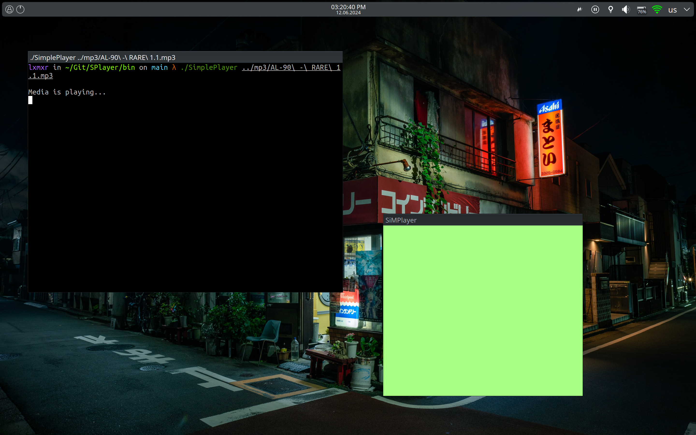
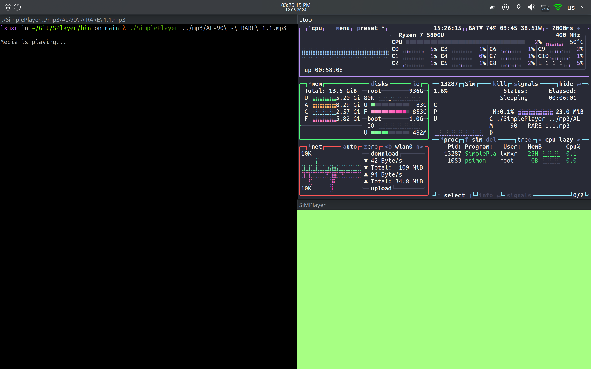

# SPlayer Documentation

## Overview

SPlayer is a simple media player application written in C++ for Linux systems. It utilizes the libVLC library for media playback and X11 for displaying the video. The player allows users to browse and select a media file, control playback (play/pause, mute, volume adjustment), and modify playback speed.

## Features

- Browse and select a media file for playback using a terminal-based file browser.
- Control playback using keyboard shortcuts:
  - `p`: Pause/resume playback.
  - `m`: Mute/unmute audio.
  - `=`: Increase volume.
  - `-`: Decrease volume.
  - `C`: Increase playback speed.
  - `D`: Reset playback speed to normal.
  - `q`: Quit the player.

## Usage

1. **Starting the Player:**
   - Compile and run the SPlayer application.
   ```bash
   ./SPlayer
   ```

2. **File Selection:**
   - Use the terminal-based file browser to navigate and select a media file from the current directory.

3. **Playback Controls:**
   - Use the following keyboard shortcuts to control playback:
     - `p`: Pause/resume playback.
     - `m`: Mute/unmute audio.
     - `=`: Increase volume.
     - `-`: Decrease volume.
     - `C`: Increase playback speed.
     - `D`: Reset playback speed to normal.
     - `q`: Quit the player.

4. **Exiting:**
   - Press `q` to quit the player and close the application.

## Screenshots





## Dependencies

- **libVLC**: Library for media playback.
- **X11**: Library for managing the display window on a Linux system.
- **ncurses**: Library for terminal control (used for file browsing).

## Compilation

Ensure you have the necessary libraries installed:
```bash
sudo apt-get install libvlc-dev libx11-dev libncurses5-dev
```

Compile the program:
```bash
g++ -o SPlayer main.cpp -lvlc -lX11 -lncurses
```
